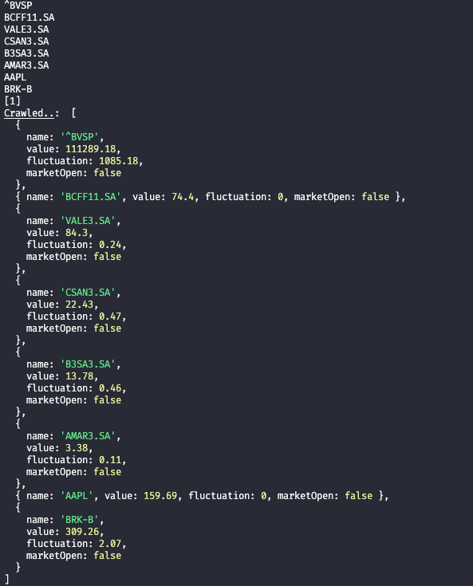

<h1>POC | Puppeteer + Node-cron</h1>

Simple Project to crawling Stock information from Yahoo finance

<h2>References</h2>
<ul>
  <li>Documentation: <a href="https://pptr.dev/">Puppeteer</a></li>
  <li>Documentation: <a href="https://github.com/node-cron/node-cron">Node-cron</a></li>
</ul>

<h2>Features</h2>
<ul>
  <li>Crawling information from Yahoo Finance an returns stock information</li>
  <li>Configured Cron to run crawling every 2 minutes</li>
</ul>

<h2>Getting started</h2>
<h3>Open src/index and add stocks in list</h3>
<pre> 
...
async function main() {
  ...
  const list = ['%5EBVSP', 'BCFF11.SA', 'VALE3.SA', 'CSAN3.SA', 'B3SA3.SA', 'AMAR3.SA', 'AAPL', 'BRK-B'];
  ...
}
main();
</pre>

<h3>Install dependences</h3>
<pre>yarn</pre>

<h3>Start application</h3>
<pre>yarn dev</pre>

<h2>Example output</h2>

<h2>License</h2>

This boilerplate is <a href="https://github.com/massaaki/massaaki/blob/main/license/mit">MIT licensed</a>
